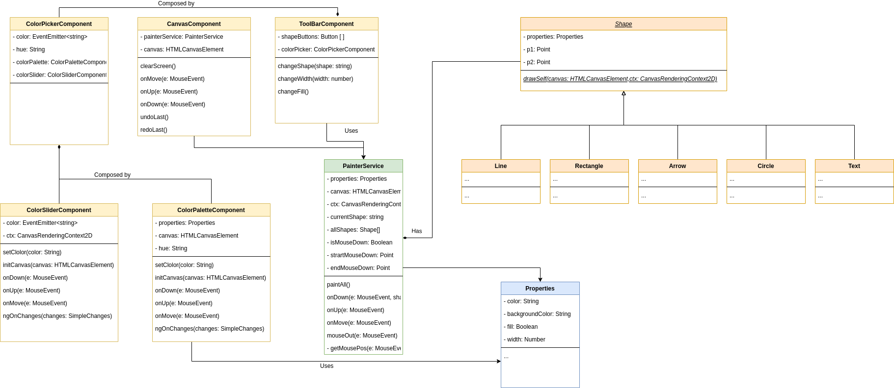

# Architecture Logicielle

This project was generated with [Angular CLI](https://github.com/angular/angular-cli) version 13.0.3.

## Run the app 

### Install packages
After having cloned the app, you can install all the packages:
```
npm i
```
<br>

### Development server
Run following commands for a dev server:  (Navigate to `http://localhost:4200/`)
```
ng serve
```
OR
```
npm start 
```

<br>

## Architecture


